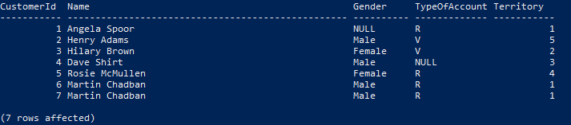

# Build a docker image of SQL Server database with prefilled data

#### Setup password for the SQL Server database
> Pull an image from the official Microsoft registry 
> ```
> docker pull mcr.microsoft.com/mssql/server:2019-latest
> ```

> Run docker with the env -e variables to setup password (At least 8 characters including uppercase, lowercase letters, base-10 digits and/or non-alphanumeric symbols)
```
docker run -e "ACCEPT_EULA=Y" -e "SA_PASSWORD=<yourpassword>" -p 1433:1433 --name <yourcontainername> -d mcr.microsoft.com/mssql/server:2019-latest
```

#### Clone this repository to the destination folder

#### Run a docker container with SQL Server database
> Build a custom docker image with prefilled data
```
docker build -t <yourusername>/<repository>:<tag> .
```

> Run a container based on the image
```
docker run -d -p 1433:1433 --name <yourcontainername> <yourusername>/<repository>:<tag>
```

#### Access the database
> Get inside the container
```
docker exec -it <yourcontainername> bash
```

> Access SQL command line
```
 /opt/mssql-tools/bin/sqlcmd -S localhost -U SA -P "<yourpassword>"
 select name from sys.databases
 go
 use aabanking
 go
 select * from dbo.customers
 go
```


